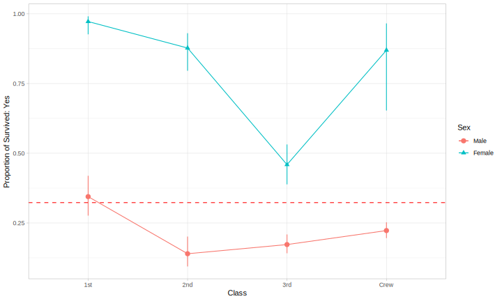

<!-- README.md is generated from README.Rmd. Please edit that file -->

```{r setup, include = FALSE}
knitr::opts_chunk$set(
  collapse = TRUE,
  comment = "#>",
  fig.path = "man/figures/README-",
  out.width = "100%"
)
```

```{r, echo=FALSE}
future::plan("multiprocess")
```

# MLtoolkit

MLtoolkit is an R package providing functions to help with machine learning & feature engineering tasks.

## Installation

You can install MLtoolkit from GitHub using:

```{r, eval=FALSE}
# install.packages("devtools")
devtools::install_github("AndrewKostandy/MLtoolkit")
```

```{r, echo=FALSE}
library(svglite)
library(patchwork)
ggplot2::theme_set(ggplot2::theme_light())
```

## Currently Implemented Functions:

- single_mod_results(): Computes performance metrics of a single caret model object across resamples.
- mult_mod_results(): Computes performance metrics of multiple caret model objects across resamples.
- plot_mod_results(): Plots a box plot with the performance metrics of multiple caret model objects across resamples.
- pred_improve(): Gets the model performance improvement of each predictor relative to the null model.
- plot_pred_improve(): Plots the model performance improvement of each predictor relative to the null model.
- get_perc(): Gets the percentiles & the interquartile range of a dataframe's numeric columns.
- trim_df(): Trims a dataframe's numeric columns using different methods.
- get_prop(): Gets the proportion of each predictor level associated with each outcome level.
- plot_prop(): Plots the proportion of each predictor level having a specific outcome level.
- get_prop2(): Gets the proportion of each combination of two predictors' levels having each outcome level.
- plot_prop2(): Plots the proportion of each combination of two predictors' levels having a specific outcome level.

## Parallelization

The following functions can make use of parallelization to increase computation speed if desired:

- mult_mod_results()
- plot_mod_results()
- pred_improve()
- plot_pred_improve()
- get_perc()
- trim_df()

The future package can be used as per the below example:

```{r, eval=FALSE}
library(future)
plan("multiprocess") # To enable parallel processing
pred_improve(...) # This function will now make use of parallel processing
plan("sequential") # To return to sequential processing if needed
```

## Example: Comparing Model Performance

The two following sections demonstrate how to compute performance metrics for caret model objects across resamples for binary classification and regression and plotting the results in each case.

### Binary Classification

We'll use the BreastCancer data set from the mlbench library and do some minor modifications on it.

The metrics computed for binary classification are: Area under ROC Curve (AUROC), Sensitivity, Specificity, Area under Precision-Recall Curve (AUPRC), Precision, F1 Score, Accuracy, Cohen's Kappa, Log Loss, Matthews Correlation Coefficient, Concordance, Discordance, Somer's D, KS Statistic, and False Discovery Rate.  

```{r, message=FALSE}
library(tidyverse)
library(caret)
library(MLtoolkit)
library(mlbench)

data(BreastCancer)
dat <- BreastCancer %>%
  select(-Id) %>%
  modify_at(c(1:9), as.numeric)

# Since caret requires the positive class (malignant) to be the first factor level in the outcome:
dat <- mutate(dat, Class = fct_rev(Class))

set.seed(42)
id <- createMultiFolds(dat$Class, k = 10, times = 4)

train_ctrl <- trainControl(method = "repeatedcv",
                           number = 10,
                           repeats = 4,
                           index = id,
                           classProbs = TRUE,
                           savePredictions = "final")

glm_fit_1 <- train(Class ~ Cl.thickness + Cell.size + Cell.shape, data = dat,
                   method = "glm",
                   trControl = train_ctrl)

glm_fit_2 <- train(Class ~ Cl.thickness + Cell.size + Cell.shape + Marg.adhesion, data = dat,
                   method = "glm",
                   trControl = train_ctrl)

glm_fit_3 <- train(Class ~ Bl.cromatin + Normal.nucleoli + Mitoses, data = dat,
                   method = "glm",
                   trControl = train_ctrl)
```

The single_mod_results() function works with a single caret model object and computes its performance metrics:

```{r}
single_mod_results(glm_fit_1, "GLM 1") %>% head()
```

The mult_mod_results() function works with multiple caret model objects and computes their model performance metrics:

```{r}
mod_results <- mult_mod_results(list(glm_fit_1, glm_fit_2, glm_fit_3), c("GLM 1", "GLM 2", "GLM 3"))
mod_results %>% head()
```

The plot_mod_results() function produces a box plot of the models performance metrics:

```{r, eval=FALSE}
plot_mod_results(mod_results, ncol = 3)
```

```{r, echo=FALSE, fig.height=8}
svglite("man/figures/README-binary_classification_1.svg", height = 10)
plot_mod_results(mod_results, ncol = 3)
invisible(dev.off())
```

<p align="center"></p>\newline

This function can alternatively take a list of caret model objects and a list or vector of model names:

```{r}
# plot_mod_results(list(glm_fit_1, glm_fit_2, glm_fit_3), c("GLM 1", "GLM 2", "GLM 3"))
```

### Regression

We'll use the iris data set.

The performance metrics computed for regression are: Root Mean Squared Error (RMSE), Mean Absolute Error (MAE), Mean Absolute Percentage Error (MAPE), Spearman's Rho, Concordance Correlation Coefficient, and RSquared. Note that MAPE will not be provided if any observations equal zero to avoid division by zero.

```{r}
set.seed(42)
id <- createMultiFolds(iris$Sepal.Length, k = 10, times = 4)

train_ctrl <- trainControl(method = "repeatedcv",
                           number = 10,
                           repeats = 4,
                           index = id,
                           savePredictions = "final")

lm_fit_1 <- train(Sepal.Length ~ Sepal.Width, data = iris,
                  method = "lm",
                  trControl = train_ctrl)

lm_fit_2 <- train(Sepal.Length ~ Sepal.Width + Petal.Length, data = iris,
                  method = "lm",
                  trControl = train_ctrl)

lm_fit_3 <- train(Sepal.Length ~ Sepal.Width + Petal.Length + Petal.Width, data = iris,
                  method = "lm",
                  trControl = train_ctrl)
```

The single_mod_results() function works with a single caret model object and computes its performance metrics:

```{r}
single_mod_results(lm_fit_1, "LM 1") %>% head()
```

The mult_mod_results() function works with multiple caret model objects and computes their model performance metrics:

```{r}
mod_results <- mult_mod_results(list(lm_fit_1, lm_fit_2, lm_fit_3), c("LM 1", "LM 2", "LM 3"))
mod_results %>% head()
```

The plot_mod_results() function produces a box plot of the models performance metrics. A 95% confidence interval for the mean can also be added:

```{r, eval=FALSE}
plot_mod_results(mod_results, conf_int95 = TRUE)
```

```{r, echo=FALSE}
svglite("man/figures/README-regression_1.svg", height = 6)
plot_mod_results(mod_results, conf_int95 = TRUE)
invisible(dev.off())
```

<p align="center"></p>\newline

### References

The "InformationValue", "caret", and "MLmetrics" packages were used to compute many of the performance metrics.

## Example: Get the Model Performance Improvement of Each Predictor Relative to the Null Model

We'll use the BreastCancer data set from the mlbench library that we have modified above and add 4 uninformative predictors to it. 2 of those uninformative predictors will be numeric and 2 will be categorical.

```{r}
dat2 <- dat %>% mutate(Rand_Num_1 = rnorm(n = nrow(dat)),
                       Rand_Num_2 = runif(n = nrow(dat)),
                       Rand_Cat_1 = sample(x = c("Cat1A", "Cat1B", "Cat1C"),
                                           size = nrow(dat), replace = TRUE,
                                           prob = c(0.4, 0.4, 0.2)),
                       Rand_Cat_2 = sample(x = c("Cat2A", "Cat2B", "Cat2C"),
                                           size = nrow(dat), replace = TRUE, 
                                           prob = c(0.1, 0.1, 0.8)))
```

The pred_improve() function returns the performance improvement of each predictor relative to the null model. 
If the outcome is categorical, then a logistic regression model is used and the area under the ROC curve is used to assess performance. If the outcome is numeric, then an ordinary least squares model is used and the root mean squared error (RMSE) is used to assess performance.

The results are estimated across resamples and the p-value is determined using a one-sided paired t-test of the predictor results and the null model results in each case. The p-values are adjusted using the Benjamini-Hochberg method to control the false discovery rate.

```{r}
pred_improve(data = dat2, outcome = Class, seed = 42, folds = 10, repeats = 3)
```

The plot_pred_improve() function can be used to return a plot directly:

```{r, eval=FALSE}
plot_pred_improve(data = dat2, outcome = Class, seed = 42, folds = 10, repeats = 3)
```

```{r, echo=FALSE}
svglite("man/figures/README-plot_pred_improve_1.svg", height = 5)
plot_pred_improve(data = dat2, outcome = Class, seed = 42, folds = 10, repeats = 3)
invisible(dev.off())
```

<p align="center"></p>\newline

### References

This technique was discussed in the book Feature Engineering and Selection: A Practical Approach for Predictive Models by Max Kuhn and Kjell Johnson.

## Example: Data Trimming

Below is a dataframe with numeric columns including univariate outliers:

```{r}
training <- data_frame(a = c(10, 11, 12, seq(70, 90, 2), 50, 60),
                       b = c(3, 11, 12, seq(30, 40, 1), 44, 80))
```

The trim_df() function will trim univariate outliers as follows:

If type = "iqr", then for each numeric variable:

- Values below the 25th percentile by more than 1.5 x IQR are trimmed to be exactly 1.5 x IQR below the 25th percentile.

- Values above the 75th percentile by more than 1.5 x IQR are trimmed to be exactly 1.5 x IQR above the 75th percentile.

&nbsp;

If type = "1_99", then for each numeric variable:

- Values below the 1st percentile are trimmed to be exactly the value of the 1st percentile.

- Values above the 99th percentile are trimmed to be exactly the value of the 99th percentile.

```{r}
training_trimmed <- trim_df(training, type = "iqr")
```

This is our training data before and after trimming:

```{r, echo=FALSE}
g1 <- ggplot(gather(training, key, value), aes(key, value)) +
  geom_boxplot(fill = "lightgray") +
  scale_y_continuous(breaks = seq(0, 100, 25), limits = c(0, 100)) +
  labs(title = "Before Trimming", x = "Variable", y = "Value") +
  theme(plot.title = element_text(hjust = 0.5))

g2 <- ggplot(gather(training_trimmed, key, value), aes(key, value)) +
  geom_boxplot(fill = "lightgray") +
  scale_y_continuous(breaks = seq(0, 100, 25), limits = c(0, 100)) +
  labs(title = "After Trimming", x = "Variable", y = "Value") +
  theme(plot.title = element_text(hjust = 0.5))

svglite("man/figures/README-trimming_1.svg", height = 5)
g1 + g2 + plot_annotation(title = "Training Data", theme = theme(plot.title = element_text(size = 20)))
invisible(dev.off())
```

<p align="center"></p>\newline

Note that test data can be trimmed using the training data percentile values.

Let's make some test data:

```{r}
test <- data_frame(a = c(0, 11, 12, seq(70, 90, 2), 50, 100),
                   b = c(25, 11, 12, seq(25, 35, 1), 100, 90))
```

Let's get the percentiles of our original data:

```{r}
training_percentiles <- get_perc(training)
training_percentiles
```

Let's use the percentiles of our training data to trim the test data:

```{r}
test_trimmed <- trim_df(test, type = "iqr", training_percentiles)
```

Let's plot the test data before and after trimming using the percentiles of the original data:

```{r, echo=FALSE}
g1 <- ggplot(gather(test, key, value), aes(key, value)) +
  geom_boxplot(fill = "lightgray") +
  scale_y_continuous(breaks = seq(0, 100, 25), limits = c(0, 100)) +
  labs(title = "Before Trimming", x = "Variable", y = "Value") +
  theme(plot.title = element_text(hjust = 0.5))

g2 <- ggplot(gather(test_trimmed, key, value), aes(key, value)) +
  geom_boxplot(fill = "lightgray") +
  scale_y_continuous(breaks = seq(0,100,25), limits = c(0,100)) +
  labs(title = "After Trimming", x = "Variable", y="Value") +
  theme(plot.title = element_text(hjust = 0.5))

svglite("man/figures/README-trimming_2.svg", height = 5)
g1 + g2 + plot_annotation(title = "Test Data", theme = theme(plot.title = element_text(size = 20)))
invisible(dev.off())
```

<p align="center"></p>\newline

## Example: Get Outcome Levels Proportions for Each Predictor Level.

This is what the diamonds data set looks like:

```{r}
head(diamonds)
```

Let's take the "cut" column to be our outcome and the "clarity" column to be our predictor. We can get the proportion of each predictor level associated with each outcome level.

```{r}
get_prop(diamonds, clarity, cut) %>% head()
```

To plot the proportions and their confidence intervals of each predictor level having a specific outcome level, we can use the plot_prop() function.

```{r, eval=FALSE}
diamonds2 <- diamonds %>%
  mutate(cut = fct_collapse(cut,
                            `>= Premium` = c("Premium", "Ideal"),
                            `<= Very Good` = c("Fair", "Good", "Very Good")))

plot_prop(diamonds2, clarity, cut, ref_level = ">= Premium", ref_value = 0.5)
```

```{r, echo=FALSE}
diamonds2 <- diamonds %>%
  mutate(cut = fct_collapse(cut,
                            `>= Premium` = c("Premium", "Ideal"),
                            `<= Very Good` = c("Very Good", "Good", "Fair")))

svglite("man/figures/README-plot_prop_1.svg", height = 6)
plot_prop(diamonds2, clarity, cut, ref_level = ">= Premium", ref_value = 0.5)
invisible(dev.off())
```

<p align="center"></p>\newline

### References

This technique was discussed in the book Feature Engineering and Selection: A Practical Approach for Predictive Models by Max Kuhn and Kjell Johnson.

## Example: Get Outcome Levels Proportions for Each Combination of Two Predictors' Levels.

Let's view a modified version of the Titanic dataset:

```{r}
Titanic2 <- as.data.frame(Titanic)
Titanic2 <- Titanic2[rep(seq(1:nrow(Titanic2)), Titanic2$Freq), -5]

head(Titanic2)
```

We can get the proportion of each combination of two predictors' levels having each outcome level.

```{r}
get_prop2(Titanic2, Class, Sex, Survived) %>% head()
```

To plot the proportions and their confidence intervals of each combination of two predictors' levels having a specific outcome level, we can use the plot_prop2() function.

```{r, eval=FALSE}
plot_prop2(Titanic2, Class, Sex, Survived, ref_level = "Yes", ref_value = 0.323)
```

```{r, echo=FALSE}
svglite("man/figures/README-plot_prop2_1.svg", height = 6)
plot_prop2(Titanic2, Class, Sex, Survived, ref_level = "Yes", ref_value = 0.323)
invisible(dev.off())
```

<p align="center"></p>\newline

```{r, echo=FALSE}
future::plan("sequential")
```

