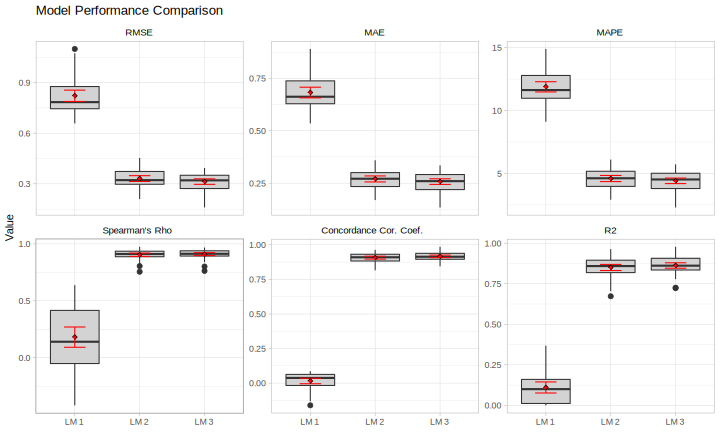

<!-- README.md is generated from README.Rmd. Please edit that file -->

```{r setup, include = FALSE}
knitr::opts_chunk$set(
  collapse = TRUE,
  comment = "#>",
  fig.path = "man/figures/README-",
  out.width = "100%"
)
```
# MLtoolkit

MLtoolkit is an R package providing functions to help with machine learning tasks.

## Installation

You can install MLtoolkit from GitHub using:

```{r, eval=FALSE}
# install.packages("devtools")
devtools::install_github("AndrewKostandy/MLtoolkit")
```

```{r, echo=FALSE}
library(svglite)
library(patchwork)
ggplot2::theme_set(ggplot2::theme_light())
```

## Currently Implemented Functions:

- compute_mod_results(): Computes performance metrics of a single caret model object across resamples.
- all_mod_results(): Computes performance metrics of multiple caret model objects across resamples.
- plot_mod_results(): Produces a box plot with the performance metrics of multiple caret model object across resamples.
- get_quartiles(): Gets quartiles of a dataframe's numeric columns.
- truncate_data(): Truncates a dataframe's numeric columns.

## Example: Comparing Model Performance

The two following sections demonstrate how to compute performance metrics for caret model objects across resamples for binary classification and regression plotting those results in each case.

### Binary Classification

The performance metrics computed for binary classification are: ROC, Sensitivity, Specificity, Precision, Accuracy, Cohen's Kappa, F1 Score, Matthews Correlation Coefficient, Concordance, Discordance, Somer's D, and KS Statistic.

```{r, message=FALSE}
library(MLtoolkit)
library(recipes)
library(mlbench)

data(BreastCancer)
dat <- BreastCancer %>%
  select(-Id) %>%
  modify_at(c(1:9), as.numeric)

# Since caret requires the positive class (malignant) to be the first factor level in the outcome:
dat <- mutate(dat, Class = fct_rev(Class))

rec1 <- recipe(Class ~ Cl.thickness + Cell.size + Cell.shape, data = dat)

rec2 <- recipe(Class ~ Marg.adhesion + Epith.c.size + Bare.nuclei, data = dat)

rec3 <- recipe(Class ~ Bl.cromatin + Normal.nucleoli + Mitoses, data = dat)

train_ctrl <- trainControl(method = "repeatedcv",
                           number = 10,
                           repeats = 4,
                           classProbs = TRUE,
                           savePredictions = "final")

glm_fit_1 <- train(rec1, data = dat,
                   method = "glm",
                   trControl = train_ctrl)

glm_fit_2 <- train(rec2, data = dat,
                   method = "glm",
                   trControl = train_ctrl)

glm_fit_3 <- train(rec3, data = dat,
                   method = "glm",
                   trControl = train_ctrl)
```

The compute_mod_results() function works with a single caret model object and computes its performance metrics:

```{r}
compute_mod_results(glm_fit_1, "GLM 1") %>% head()
```

The all_mod_results() function works with multiple caret model objects and computes their model performance metrics:

```{r}
mod_results <- all_mod_results(list(glm_fit_1, glm_fit_2, glm_fit_3), c("GLM 1", "GLM 2", "GLM 3"))
mod_results %>% head()
```

The plot_mod_results() function produces a box plot of the models performance metrics:

```{r, eval=FALSE}
plot_mod_results(mod_results, plot_columns = 3)
```

```{r, echo=FALSE, fig.height=8}
svglite("man/figures/README-binary_classification_1.svg", height = 10)
plot_mod_results(mod_results, plot_columns = 3)
invisible(dev.off())
```

<p align="center"></p>\newline

This function can alternatively take a list of caret model objects and a list or vector of model names:

```{r}
# plot_mod_results(list(glm_fit_1, glm_fit_2, glm_fit_3), c("GLM 1", "GLM 2", "GLM 3"))
```

### Regression

The performance metrics computed for regression are: Root Mean Squared Error (RMSE), RSquared, Mean Absolute Error (MAE), and Mean Absolute Percentage Error (MAPE).

```{r}
train_ctrl <- trainControl(method = "repeatedcv",
                           number = 10,
                           repeats = 4,
                           savePredictions = "final")

lm_fit_1 <- train(Sepal.Length ~ Sepal.Width, data = iris,
                  method = "lm",
                  trControl = train_ctrl)

lm_fit_2 <- train(Sepal.Length ~ Sepal.Width + Petal.Length, data = iris,
                  method = "lm",
                  trControl = train_ctrl)

lm_fit_3 <- train(Sepal.Length ~ Sepal.Width + Petal.Length + Petal.Width, data = iris,
                  method = "lm",
                  trControl = train_ctrl)
```

The compute_mod_results() function works with a single caret model object and computes its performance metrics:

```{r}
compute_mod_results(lm_fit_1, "LM 1") %>% head()
```

The all_mod_results() function works with multiple caret model objects and computes their model performance metrics:

```{r}
mod_results <- all_mod_results(list(lm_fit_1, lm_fit_2, lm_fit_3), c("LM 1", "LM 2", "LM 3"))
mod_results %>% head()
```

The plot_mod_results() function produces a box plot of the models performance metrics:

```{r, eval=FALSE}
plot_mod_results(mod_results)
```

```{r, echo=FALSE}
svglite("man/figures/README-regression_1.svg", height = 6)
plot_mod_results(mod_results)
invisible(dev.off())
```

<p align="center"></p>\newline

### References

The "InformationValue", "caret", and "mltools" packages were used to compute many of the performance metrics.

## Example: Data Truncation

This is a basic example which shows the truncate_data() function in the package.

Below is a dataframe with numeric columns including univariate outliers:

```{r}
mydata <- data_frame(a=c(10,11,12,seq(70,90,2),50,60),
                     b=c(3,11,12,seq(30,40,1),44,80))
```

The truncate_data() function will truncate univariate outliers as follows:

- Values below the 1st quartile by more than 1.5 x IQR are truncated to be exactly 1.5 x IQR below the 1st quartile.

- Values above the 3rd quartile by more than 1.5 x IQR are truncated to be exactly 1.5 x IQR above the 3rd quartile.

```{r}
mydata_truncated <- truncate_data(mydata)
```

This is our data (training data) before and after truncation:

```{r, echo=FALSE}
g1 <- ggplot(gather(mydata, key, value), aes(key, value)) +
  geom_boxplot() +
  scale_y_continuous(breaks = seq(0,100,25), limits = c(0,100)) +
  labs(title = "Before Truncation", x = "Variable", y="Value")
g2 <- ggplot(gather(mydata_truncated, key, value), aes(key, value)) +
  geom_boxplot() +
  scale_y_continuous(breaks = seq(0,100,25), limits = c(0,100)) +
  labs(title = "After Truncation", x = "Variable", y="Value")

svglite("man/figures/README-truncation_1.svg", height = 5)
g1 + g2 + plot_annotation(title = "Training Data", theme = theme(plot.title = element_text(size = 20)))
invisible(dev.off())
```

<p align="center"></p>\newline

Note that new data (eg. test data), can be truncated using the training data quartile values:

Let's make some test data:

```{r}
mydata_test <- data_frame(a=c(0,11,12, seq(70,90,2), 50, 100),
                          b=c(25,11,12, seq(25,35,1), 100, 90))
```

Let's get the quartiles of our original data:

```{r}
mydata_quartiles <- get_quartiles(mydata)
mydata_quartiles
```

Let's use the quartiles of our original data to truncate the test data:

```{r}
mydata_test_truncated <- truncate_data(mydata_test, mydata_quartiles)
```

Let's plot the test data before and after truncation using the quartiles of the original data:

```{r, echo=FALSE}
g1 <- ggplot(gather(mydata_test, key, value), aes(key, value)) +
  geom_boxplot() +
  scale_y_continuous(breaks = seq(0,100,25), limits = c(0,100)) +
  labs(title = "Before Truncation", x = "Variable", y="Value")
g2 <- ggplot(gather(mydata_test_truncated, key, value), aes(key, value)) +
  geom_boxplot() +
  scale_y_continuous(breaks = seq(0,100,25), limits = c(0,100)) +
  labs(title = "After Truncation", x = "Variable", y="Value")

svglite("man/figures/README-truncation_2.svg", height = 5)
g1 + g2 + plot_annotation(title = "Test Data", theme = theme(plot.title = element_text(size = 20)))
invisible(dev.off())
```

<p align="center"></p>\newline
