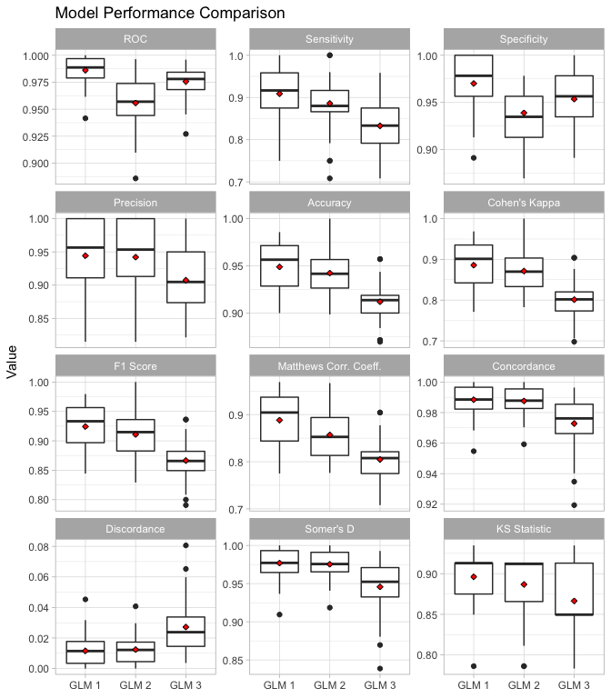
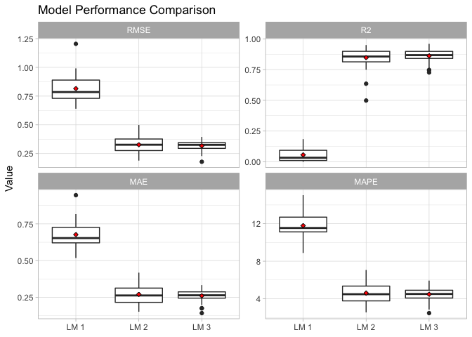

<!-- README.md is generated from README.Rmd. Please edit that file -->
MLtoolkit
=========

MLtoolkit is an R package providing functions to help with machine learning tasks.

Installation
------------

You can install MLtoolkit from GitHub using:

``` r
# install.packages("devtools")
devtools::install_github("AndrewKostandy/MLtoolkit")
```

Example: Comparing Model Performance
------------------------------------

### Binary Classification

``` r
library(MLtoolkit)
library(recipes)
library(mlbench)

data(BreastCancer)
dat <- BreastCancer %>%
  select(-Id) %>%
  modify_at(c(1:9), as.numeric)

# Since caret requires the positive class (malignant) to be the first factor level in the outcome:
dat <- mutate(dat, Class = fct_rev(Class))

rec1 <- recipe(Class ~ Cl.thickness + Cell.size + Cell.shape, data = dat)

rec2 <- recipe(Class ~ Marg.adhesion + Epith.c.size + Bare.nuclei, data = dat)

rec3 <- recipe(Class ~ Bl.cromatin + Normal.nucleoli + Mitoses, data = dat)

train_ctrl <- trainControl(method = "repeatedcv",
                           number = 10,
                           repeats = 4,
                           classProbs = TRUE,
                           savePredictions = "final")

glm_fit_1 <- train(rec1, data = dat,
                   method = "glm",
                   trControl = train_ctrl)

glm_fit_2 <- train(rec2, data = dat,
                   method = "glm",
                   trControl = train_ctrl)

glm_fit_3 <- train(rec3, data = dat,
                   method = "glm",
                   trControl = train_ctrl)
```

The compute\_mod\_results() function works with a single caret model object and computes its performance results:

``` r
compute_mod_results(glm_fit_1, "GLM 1") %>% head()
#> # A tibble: 6 x 14
#>   Model Resample   ROC Sensitivity Specificity Precision Accuracy
#>   <chr> <chr>    <dbl>       <dbl>       <dbl>     <dbl>    <dbl>
#> 1 GLM 1 Fold01.… 0.981       0.958       0.957     0.92     0.957
#> 2 GLM 1 Fold01.… 0.999       0.958       1         1        0.986
#> 3 GLM 1 Fold01.… 0.984       0.917       0.978     0.957    0.957
#> 4 GLM 1 Fold01.… 0.964       0.958       0.935     0.885    0.943
#> 5 GLM 1 Fold02.… 0.967       0.8         0.978     0.952    0.914
#> 6 GLM 1 Fold02.… 0.989       0.833       0.978     0.952    0.929
#> # ... with 7 more variables: `Cohen's Kappa` <dbl>, `F1 Score` <dbl>,
#> #   `Matthews Corr. Coeff.` <dbl>, Concordance <dbl>, Discordance <dbl>,
#> #   `Somer's D` <dbl>, `KS Statistic` <dbl>
```

The all\_mod\_results() function works with multiple caret model objects and computes their model performance results:

``` r
mods_results <- all_mod_results(list(glm_fit_1, glm_fit_2, glm_fit_3), c("GLM 1", "GLM 2", "GLM 3"))
mods_results %>% head()
#> # A tibble: 6 x 14
#>   Model Resample   ROC Sensitivity Specificity Precision Accuracy
#>   <chr> <chr>    <dbl>       <dbl>       <dbl>     <dbl>    <dbl>
#> 1 GLM 1 Fold01.… 0.981       0.958       0.957     0.92     0.957
#> 2 GLM 1 Fold01.… 0.999       0.958       1         1        0.986
#> 3 GLM 1 Fold01.… 0.984       0.917       0.978     0.957    0.957
#> 4 GLM 1 Fold01.… 0.964       0.958       0.935     0.885    0.943
#> 5 GLM 1 Fold02.… 0.967       0.8         0.978     0.952    0.914
#> 6 GLM 1 Fold02.… 0.989       0.833       0.978     0.952    0.929
#> # ... with 7 more variables: `Cohen's Kappa` <dbl>, `F1 Score` <dbl>,
#> #   `Matthews Corr. Coeff.` <dbl>, Concordance <dbl>, Discordance <dbl>,
#> #   `Somer's D` <dbl>, `KS Statistic` <dbl>
```

The plot\_mod\_results() function produces a box plot of the models performance results:

``` r
plot_mod_results(mods_results, plot_columns = 3)
```



The plot\_mod\_results() function can alternatively take a list of caret model objects and a list or vector of model names:

``` r
# plot_mod_results(list(glm_fit_1, glm_fit_2, glm_fit_3), c("GLM 1", "GLM 2", "GLM 3"))
```

### Regression

``` r
train_ctrl <- trainControl(method = "repeatedcv",
                           number = 10,
                           repeats = 4,
                           savePredictions = "final")

lm_fit_1 <- train(Sepal.Length ~ Sepal.Width, data = iris,
                  method = "lm",
                  trControl = train_ctrl)

lm_fit_2 <- train(Sepal.Length ~ Sepal.Width + Petal.Length, data = iris,
                  method = "lm",
                  trControl = train_ctrl)

lm_fit_3 <- train(Sepal.Length ~ Sepal.Width + Petal.Length + Petal.Width, data = iris,
                  method = "lm",
                  trControl = train_ctrl)
```

The compute\_mod\_results() function works with a single caret model object and computes its performance results:

``` r
compute_mod_results(lm_fit_1, "LM 1") %>% head()
#> # A tibble: 6 x 6
#>   Model Resample     RMSE       R2   MAE  MAPE
#>   <chr> <chr>       <dbl>    <dbl> <dbl> <dbl>
#> 1 LM 1  Fold01.Rep1 0.783 0.0564   0.637 10.9 
#> 2 LM 1  Fold01.Rep2 0.968 0.262    0.845 14.3 
#> 3 LM 1  Fold01.Rep3 0.688 0.000850 0.582  9.98
#> 4 LM 1  Fold01.Rep4 0.677 0.0242   0.593 10.2 
#> 5 LM 1  Fold02.Rep1 0.907 0.00114  0.774 13.0 
#> 6 LM 1  Fold02.Rep2 0.796 0.0401   0.662 11.3
```

The all\_mod\_results() function works with multiple caret model objects and computes their model performance results:

``` r
mods_results <- all_mod_results(list(lm_fit_1, lm_fit_2, lm_fit_3), c("LM 1", "LM 2", "LM 3"))
mods_results %>% head()
#> # A tibble: 6 x 6
#>   Model Resample     RMSE       R2   MAE  MAPE
#>   <chr> <chr>       <dbl>    <dbl> <dbl> <dbl>
#> 1 LM 1  Fold01.Rep1 0.783 0.0564   0.637 10.9 
#> 2 LM 1  Fold01.Rep2 0.968 0.262    0.845 14.3 
#> 3 LM 1  Fold01.Rep3 0.688 0.000850 0.582  9.98
#> 4 LM 1  Fold01.Rep4 0.677 0.0242   0.593 10.2 
#> 5 LM 1  Fold02.Rep1 0.907 0.00114  0.774 13.0 
#> 6 LM 1  Fold02.Rep2 0.796 0.0401   0.662 11.3
```

The plot\_mod\_results() function produces a box plot of the models performance results:

``` r
plot_mod_results(mods_results)
```



The plot\_mod\_results() function can alternatively take a list of caret model objects and a list or vector of model names:

``` r
# plot_mod_results(list(lm_fit_1, lm_fit_2, lm_fit_3), c("LM 1", "LM 2", "LM 3"))
```

Data Truncation Example
-----------------------

This is a basic example which shows the truncate\_data() function in the package.

Below is a dataframe with numeric columns including univariate outliers:

``` r
theme_set(theme_light())

mydata <- tibble(a=(c(10,11,12,seq(70,90,2),50,60)),
                 b=(c(5,11,12,seq(10,20,1),50,60)),
                 c=(c(3,11,12,seq(30,40,1),44,80)),
                 d=(c(0,0,12,seq(20,25,0.5),50,100)))

ggplot(gather(mydata, key, value), aes(key, value)) + geom_boxplot()
```


The truncate\_data() function will truncate univariate outliers as follows:

-   Values below the 1st quartile by more than 1.5 x IQR are truncated to be exactly 1.5 x IQR below the 1st quartile.

-   Values above the 3rd quartile by more than 1.5 x IQR are truncated to be exactly 1.5 x IQR above the 3rd quartile.

After truncation, this is what the data will look like:

``` r
mydata2 <- truncate_data(mydata)
ggplot(gather(mydata2, key, value), aes(key, value)) + geom_boxplot()
```


Note new data (eg. test data), can be truncated using the training data quartile values:
