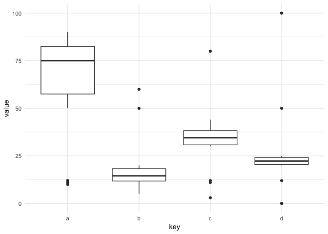
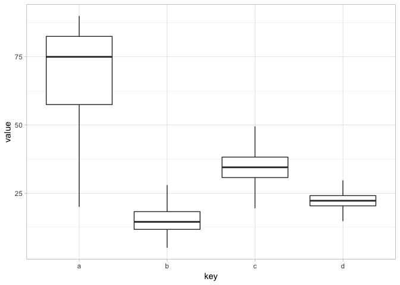

<!-- README.md is generated from README.Rmd. Please edit that file -->
MLtoolkit
=========

MLtoolkit is an R package with miscellaneous functions.

Installation
------------

You can install AKmisc from GitHub with:

``` r
# install.packages("devtools")
devtools::install_github("AndrewKostandy/MLtoolkit")
#> Skipping install of 'MLtoolkit' from a github remote, the SHA1 (a3bb9c34) has not changed since last install.
#>   Use `force = TRUE` to force installation
```

Example
-------

This is a basic example which shows the truncate\_data() function in the package.

Below is a dataframe with numeric columns including univariate outliers:

``` r
library(ggplot2)
library(tidyr)
library(MLtoolkit)
#> Loading required package: dplyr
#> 
#> Attaching package: 'dplyr'
#> The following objects are masked from 'package:stats':
#> 
#>     filter, lag
#> The following objects are masked from 'package:base':
#> 
#>     intersect, setdiff, setequal, union
#> Loading required package: purrr
theme_set(theme_minimal())

mydata <- tibble(a=(c(10,11,12,seq(70,90,2),50,60)),
                 b=(c(5,11,12,seq(10,20,1),50,60)),
                 c=(c(3,11,12,seq(30,40,1),44,80)),
                 d=(c(0,0,12,seq(20,25,0.5),50,100)))

ggplot(gather(mydata, key, value), aes(key, value)) + geom_boxplot()
```



The truncate\_data() function will truncate univariate outliers as follows:

-   Values below the 1st quartile by more than 1.5 x IQR are truncated to be exactly 1.5 x IQR below the 1st quartile.

-   Values above the 3rd quartile by more than 1.5 x IQR are truncated to be exactly 1.5 x IQR above the 3rd quartile.

After truncation, this is what the data will look like:

``` r
mydata2 <- truncate_data(mydata)
ggplot(gather(mydata2, key, value), aes(key, value)) + geom_boxplot()
```


