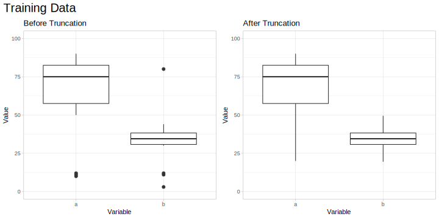

<!-- README.md is generated from README.Rmd. Please edit that file -->
MLtoolkit
=========

MLtoolkit is an R package providing functions to help with machine learning tasks.

Installation
------------

You can install MLtoolkit from GitHub using:

``` r
# install.packages("devtools")
devtools::install_github("AndrewKostandy/MLtoolkit")
```

Currently Implemented Functions:
--------------------------------

-   compute\_mod\_results(): Computes performance metrics of a single caret model object across resamples.
-   all\_mod\_results(): Computes performance metrics of multiple caret model objects across resamples.
-   plot\_mod\_results(): Produces a box plot with the performance metrics of multiple caret model object across resamples.
-   get\_perc(): Gets percentiles & interquartile range of a dataframe's numeric columns.
-   trunc\_df(): Truncates a dataframe's numeric columns using different methods.

Example: Comparing Model Performance
------------------------------------

The two following sections demonstrate how to compute performance metrics for caret model objects across resamples for binary classification and regression plotting those results in each case.

### Binary Classification

The performance metrics computed for binary classification are: ROC, Sensitivity, Specificity, Precision, Accuracy, Cohen's Kappa, F1 Score, Matthews Correlation Coefficient, Concordance, Discordance, Somer's D, and KS Statistic.

``` r
library(MLtoolkit)
library(recipes)
library(mlbench)

data(BreastCancer)
dat <- BreastCancer %>%
  select(-Id) %>%
  modify_at(c(1:9), as.numeric)

# Since caret requires the positive class (malignant) to be the first factor level in the outcome:
dat <- mutate(dat, Class = fct_rev(Class))

rec1 <- recipe(Class ~ Cl.thickness + Cell.size + Cell.shape, data = dat)

rec2 <- recipe(Class ~ Marg.adhesion + Epith.c.size + Bare.nuclei, data = dat)

rec3 <- recipe(Class ~ Bl.cromatin + Normal.nucleoli + Mitoses, data = dat)

train_ctrl <- trainControl(method = "repeatedcv",
                           number = 10,
                           repeats = 4,
                           classProbs = TRUE,
                           savePredictions = "final")

glm_fit_1 <- train(rec1, data = dat,
                   method = "glm",
                   trControl = train_ctrl)

glm_fit_2 <- train(rec2, data = dat,
                   method = "glm",
                   trControl = train_ctrl)

glm_fit_3 <- train(rec3, data = dat,
                   method = "glm",
                   trControl = train_ctrl)
```

The compute\_mod\_results() function works with a single caret model object and computes its performance metrics:

``` r
compute_mod_results(glm_fit_1, "GLM 1") %>% head()
#> # A tibble: 6 x 14
#>   Model Resample   ROC Sensitivity Specificity Precision Accuracy
#>   <chr> <chr>    <dbl>       <dbl>       <dbl>     <dbl>    <dbl>
#> 1 GLM 1 Fold01.… 0.979       0.917       0.957     0.917    0.943
#> 2 GLM 1 Fold01.… 0.995       0.958       0.957     0.92     0.957
#> 3 GLM 1 Fold01.… 0.997       1           0.978     0.96     0.986
#> 4 GLM 1 Fold01.… 0.986       1           0.978     0.96     0.986
#> 5 GLM 1 Fold02.… 0.990       0.833       0.978     0.952    0.929
#> 6 GLM 1 Fold02.… 0.998       0.958       1         1        0.986
#> # ... with 7 more variables: `Cohen's Kappa` <dbl>, `F1 Score` <dbl>,
#> #   `Matthews Corr. Coeff.` <dbl>, Concordance <dbl>, Discordance <dbl>,
#> #   `Somer's D` <dbl>, `KS Statistic` <dbl>
```

The all\_mod\_results() function works with multiple caret model objects and computes their model performance metrics:

``` r
mod_results <- all_mod_results(list(glm_fit_1, glm_fit_2, glm_fit_3), c("GLM 1", "GLM 2", "GLM 3"))
mod_results %>% head()
#> # A tibble: 6 x 14
#>   Model Resample   ROC Sensitivity Specificity Precision Accuracy
#>   <chr> <chr>    <dbl>       <dbl>       <dbl>     <dbl>    <dbl>
#> 1 GLM 1 Fold01.… 0.979       0.917       0.957     0.917    0.943
#> 2 GLM 1 Fold01.… 0.995       0.958       0.957     0.92     0.957
#> 3 GLM 1 Fold01.… 0.997       1           0.978     0.96     0.986
#> 4 GLM 1 Fold01.… 0.986       1           0.978     0.96     0.986
#> 5 GLM 1 Fold02.… 0.990       0.833       0.978     0.952    0.929
#> 6 GLM 1 Fold02.… 0.998       0.958       1         1        0.986
#> # ... with 7 more variables: `Cohen's Kappa` <dbl>, `F1 Score` <dbl>,
#> #   `Matthews Corr. Coeff.` <dbl>, Concordance <dbl>, Discordance <dbl>,
#> #   `Somer's D` <dbl>, `KS Statistic` <dbl>
```

The plot\_mod\_results() function produces a box plot of the models performance metrics:

``` r
plot_mod_results(mod_results, plot_cols = 3)
```

<p align="center">

</p>

This function can alternatively take a list of caret model objects and a list or vector of model names:

``` r
# plot_mod_results(list(glm_fit_1, glm_fit_2, glm_fit_3), c("GLM 1", "GLM 2", "GLM 3"))
```

### Regression

The performance metrics computed for regression are: Root Mean Squared Error (RMSE), RSquared, Mean Absolute Error (MAE), and Mean Absolute Percentage Error (MAPE). Note that MAPE will not be provided if any observations equal zero to avoid division by zero.

``` r
train_ctrl <- trainControl(method = "repeatedcv",
                           number = 10,
                           repeats = 4,
                           savePredictions = "final")

lm_fit_1 <- train(Sepal.Length ~ Sepal.Width, data = iris,
                  method = "lm",
                  trControl = train_ctrl)

lm_fit_2 <- train(Sepal.Length ~ Sepal.Width + Petal.Length, data = iris,
                  method = "lm",
                  trControl = train_ctrl)

lm_fit_3 <- train(Sepal.Length ~ Sepal.Width + Petal.Length + Petal.Width, data = iris,
                  method = "lm",
                  trControl = train_ctrl)
```

The compute\_mod\_results() function works with a single caret model object and computes its performance metrics:

``` r
compute_mod_results(lm_fit_1, "LM 1") %>% head()
#> # A tibble: 6 x 6
#>   Model Resample     RMSE      R2   MAE  MAPE
#>   <chr> <chr>       <dbl>   <dbl> <dbl> <dbl>
#> 1 LM 1  Fold01.Rep1 0.744 0.00525 0.651  11.4
#> 2 LM 1  Fold01.Rep2 0.906 0.0130  0.729  12.3
#> 3 LM 1  Fold01.Rep3 0.823 0.0828  0.688  12.2
#> 4 LM 1  Fold01.Rep4 0.737 0.0886  0.629  11.5
#> 5 LM 1  Fold02.Rep1 0.799 0.0811  0.686  12.1
#> 6 LM 1  Fold02.Rep2 0.870 0.0227  0.694  11.9
```

The all\_mod\_results() function works with multiple caret model objects and computes their model performance metrics:

``` r
mod_results <- all_mod_results(list(lm_fit_1, lm_fit_2, lm_fit_3), c("LM 1", "LM 2", "LM 3"))
mod_results %>% head()
#> # A tibble: 6 x 6
#>   Model Resample     RMSE      R2   MAE  MAPE
#>   <chr> <chr>       <dbl>   <dbl> <dbl> <dbl>
#> 1 LM 1  Fold01.Rep1 0.744 0.00525 0.651  11.4
#> 2 LM 1  Fold01.Rep2 0.906 0.0130  0.729  12.3
#> 3 LM 1  Fold01.Rep3 0.823 0.0828  0.688  12.2
#> 4 LM 1  Fold01.Rep4 0.737 0.0886  0.629  11.5
#> 5 LM 1  Fold02.Rep1 0.799 0.0811  0.686  12.1
#> 6 LM 1  Fold02.Rep2 0.870 0.0227  0.694  11.9
```

The plot\_mod\_results() function produces a box plot of the models performance metrics. A 95% confidence interval for the mean can also be added:

``` r
plot_mod_results(mod_results, conf_int95 = TRUE)
```

<p align="center">

</p>

### References

The "InformationValue", "caret", and "mltools" packages were used to compute many of the performance metrics.

Example: Data Truncation
------------------------

This is a basic example which shows the truncate\_data() function in the package.

Below is a dataframe with numeric columns including univariate outliers:

``` r
mydata <- data_frame(a=c(10,11,12,seq(70,90,2),50,60),
                     b=c(3,11,12,seq(30,40,1),44,80))
```

The trunc\_df() function will truncate univariate outliers as follows:

If type="iqr", then for each numeric variable:

-   Values below the 25th percentile by more than 1.5 x IQR are truncated to be exactly 1.5 x IQR below the 25th percentile.

-   Values above the 75th percentile by more than 1.5 x IQR are truncated to be exactly 1.5 x IQR above the 75th percentile.

 

If type="1\_99", then for each numeric variable:

-   Values below the 1st percentile are truncated to be exactly the value of the 1st percentile.

-   Values above the 99th percentile are truncated to be exactly the value of the 99th percentile.

``` r
mydata_truncated <- trunc_df(mydata, type = "iqr")
```

This is our data (training data) before and after truncation:

<p align="center">

</p>

Note that new data (eg. test data), can be truncated using the training data percentile values:

Let's make some test data:

``` r
mydata_test <- data_frame(a=c(0,11,12, seq(70,90,2), 50, 100),
                          b=c(25,11,12, seq(25,35,1), 100, 90))
```

Let's get the percentiles of our original data:

``` r
mydata_percentiles <- get_perc(mydata)
mydata_percentiles
#> # A tibble: 6 x 3
#>   Key         a     b
#>   <chr>   <dbl> <dbl>
#> 1 Perc 1   10.1  4.20
#> 2 Perc 25  57.5 30.8 
#> 3 Perc 50  75   34.5 
#> 4 Perc 75  82.5 38.2 
#> 5 Perc 99  89.7 74.6 
#> 6 IQR      25    7.5
```

Let's use the percentiles of our original data to truncate the test data:

``` r
mydata_test_truncated <- trunc_df(mydata_test, type="iqr", mydata_percentiles)
```

Let's plot the test data before and after truncation using the percentiles of the original data:

<p align="center">

</p>
