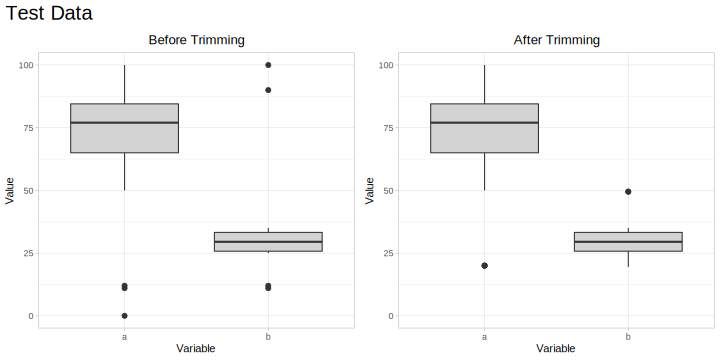

<!-- README.md is generated from README.Rmd. Please edit that file -->
MLtoolkit
=========

MLtoolkit is an R package providing functions to help with machine learning tasks.

Installation
------------

You can install MLtoolkit from GitHub using:

``` r
# install.packages("devtools")
devtools::install_github("AndrewKostandy/MLtoolkit")
```

Currently Implemented Functions:
--------------------------------

-   compute\_mod\_results(): Computes performance metrics of a single caret model object across resamples.
-   all\_mod\_results(): Computes performance metrics of multiple caret model objects across resamples.
-   plot\_mod\_results(): Creates a box plot with the performance metrics of multiple caret model objects across resamples.
-   get\_perc(): Gets the percentiles & the interquartile range of a dataframe's numeric columns.
-   trim\_df(): Trims a dataframe's numeric columns using different methods.

Example: Comparing Model Performance
------------------------------------

The two following sections demonstrate how to compute performance metrics for caret model objects across resamples for binary classification and regression plotting those results in each case.

### Binary Classification

The metrics computed for binary classification are: Area under ROC Curve (AUROC), Sensitivity, Specificity, Area under Precision-Recall Curve (AUPRC), Precision, F1 Score, Accuracy, Cohen's Kappa, Log Loss, Matthews Correlation Coefficient, Concordance, Discordance, Somer's D, and KS Statistic.

``` r
library(MLtoolkit)
library(recipes)
library(mlbench)

data(BreastCancer)
dat <- BreastCancer %>%
  select(-Id) %>%
  modify_at(c(1:9), as.numeric)

# Since caret requires the positive class (malignant) to be the first factor level in the outcome:
dat <- mutate(dat, Class = fct_rev(Class))

rec1 <- recipe(Class ~ Cl.thickness + Cell.size + Cell.shape, data = dat)

rec2 <- recipe(Class ~ Cl.thickness + Cell.size + Cell.shape + Marg.adhesion, data = dat)

rec3 <- recipe(Class ~ Bl.cromatin + Normal.nucleoli + Mitoses, data = dat)

set.seed(42)
id <- createMultiFolds(dat$Class, k = 10, times = 4)

train_ctrl <- trainControl(method = "repeatedcv",
                           number = 10,
                           repeats = 4,
                           index = id,
                           classProbs = TRUE,
                           savePredictions = "final")

glm_fit_1 <- train(rec1, data = dat,
                   method = "glm",
                   trControl = train_ctrl)

glm_fit_2 <- train(rec2, data = dat,
                   method = "glm",
                   trControl = train_ctrl)

glm_fit_3 <- train(rec3, data = dat,
                   method = "glm",
                   trControl = train_ctrl)
```

The compute\_mod\_results() function works with a single caret model object and computes its performance metrics:

``` r
compute_mod_results(glm_fit_1, "GLM 1") %>% head()
#> # A tibble: 6 x 16
#>   Model Resample AUROC Sensitivity Specificity AUPRC Precision `F1 Score`
#>   <chr> <chr>    <dbl>       <dbl>       <dbl> <dbl>     <dbl>      <dbl>
#> 1 GLM 1 Fold01.… 0.996       0.958       0.978 0.949     0.958      0.958
#> 2 GLM 1 Fold01.… 1           1           1     0.96      1          1    
#> 3 GLM 1 Fold01.… 0.967       0.875       1     0.931     1          0.933
#> 4 GLM 1 Fold01.… 0.982       0.958       0.978 0.879     0.958      0.958
#> 5 GLM 1 Fold02.… 0.984       0.917       0.978 0.882     0.957      0.936
#> 6 GLM 1 Fold02.… 0.983       0.958       0.956 0.925     0.92       0.939
#> # ... with 8 more variables: Accuracy <dbl>, `Cohen's Kappa` <dbl>, `Log
#> #   Loss` <dbl>, `Matthews Corr. Coef.` <dbl>, Concordance <dbl>,
#> #   Discordance <dbl>, `Somer's D` <dbl>, `KS Statistic` <dbl>
```

The all\_mod\_results() function works with multiple caret model objects and computes their model performance metrics:

``` r
mod_results <- all_mod_results(list(glm_fit_1, glm_fit_2, glm_fit_3), c("GLM 1", "GLM 2", "GLM 3"))
mod_results %>% head()
#> # A tibble: 6 x 16
#>   Model Resample AUROC Sensitivity Specificity AUPRC Precision `F1 Score`
#>   <chr> <chr>    <dbl>       <dbl>       <dbl> <dbl>     <dbl>      <dbl>
#> 1 GLM 1 Fold01.… 0.996       0.958       0.978 0.949     0.958      0.958
#> 2 GLM 1 Fold01.… 1           1           1     0.96      1          1    
#> 3 GLM 1 Fold01.… 0.967       0.875       1     0.931     1          0.933
#> 4 GLM 1 Fold01.… 0.982       0.958       0.978 0.879     0.958      0.958
#> 5 GLM 1 Fold02.… 0.984       0.917       0.978 0.882     0.957      0.936
#> 6 GLM 1 Fold02.… 0.983       0.958       0.956 0.925     0.92       0.939
#> # ... with 8 more variables: Accuracy <dbl>, `Cohen's Kappa` <dbl>, `Log
#> #   Loss` <dbl>, `Matthews Corr. Coef.` <dbl>, Concordance <dbl>,
#> #   Discordance <dbl>, `Somer's D` <dbl>, `KS Statistic` <dbl>
```

The plot\_mod\_results() function produces a box plot of the models performance metrics:

``` r
plot_mod_results(mod_results, plot_cols = 3)
```

<p align="center">

</p>

This function can alternatively take a list of caret model objects and a list or vector of model names:

``` r
# plot_mod_results(list(glm_fit_1, glm_fit_2, glm_fit_3), c("GLM 1", "GLM 2", "GLM 3"))
```

### Regression

The performance metrics computed for regression are: Root Mean Squared Error (RMSE), Mean Absolute Error (MAE), Mean Absolute Percentage Error (MAPE), Spearman's Rho, Concordance Correlation Coefficient, and RSquared. Note that MAPE will not be provided if any observations equal zero to avoid division by zero.

``` r
set.seed(42)
id <- createMultiFolds(iris$Sepal.Length, k = 10, times = 4)

train_ctrl <- trainControl(method = "repeatedcv",
                           number = 10,
                           repeats = 4,
                           index = id,
                           savePredictions = "final")

lm_fit_1 <- train(Sepal.Length ~ Sepal.Width, data = iris,
                  method = "lm",
                  trControl = train_ctrl)

lm_fit_2 <- train(Sepal.Length ~ Sepal.Width + Petal.Length, data = iris,
                  method = "lm",
                  trControl = train_ctrl)

lm_fit_3 <- train(Sepal.Length ~ Sepal.Width + Petal.Length + Petal.Width, data = iris,
                  method = "lm",
                  trControl = train_ctrl)
```

The compute\_mod\_results() function works with a single caret model object and computes its performance metrics:

``` r
compute_mod_results(lm_fit_1, "LM 1") %>% head()
#> # A tibble: 6 x 8
#>   Model Resample  RMSE   MAE  MAPE `Spearman's Rho` `Concordance Co…     R2
#>   <chr> <chr>    <dbl> <dbl> <dbl>            <dbl>            <dbl>  <dbl>
#> 1 LM 1  Fold01.… 0.940 0.789  14.2          -0.0892          -0.0335 0.0267
#> 2 LM 1  Fold01.… 1.10  0.890  14.9          -0.216           -0.103  0.251 
#> 3 LM 1  Fold01.… 0.761 0.616  11.0           0.146            0.0473 0.0787
#> 4 LM 1  Fold01.… 0.771 0.644  10.6           0.389            0.0655 0.181 
#> 5 LM 1  Fold02.… 0.726 0.633  11.3           0.216            0.0464 0.0460
#> 6 LM 1  Fold02.… 0.750 0.641  11.5           0.440            0.0676 0.104
```

The all\_mod\_results() function works with multiple caret model objects and computes their model performance metrics:

``` r
mod_results <- all_mod_results(list(lm_fit_1, lm_fit_2, lm_fit_3), c("LM 1", "LM 2", "LM 3"))
mod_results %>% head()
#> # A tibble: 6 x 8
#>   Model Resample  RMSE   MAE  MAPE `Spearman's Rho` `Concordance Co…     R2
#>   <chr> <chr>    <dbl> <dbl> <dbl>            <dbl>            <dbl>  <dbl>
#> 1 LM 1  Fold01.… 0.940 0.789  14.2          -0.0892          -0.0335 0.0267
#> 2 LM 1  Fold01.… 1.10  0.890  14.9          -0.216           -0.103  0.251 
#> 3 LM 1  Fold01.… 0.761 0.616  11.0           0.146            0.0473 0.0787
#> 4 LM 1  Fold01.… 0.771 0.644  10.6           0.389            0.0655 0.181 
#> 5 LM 1  Fold02.… 0.726 0.633  11.3           0.216            0.0464 0.0460
#> 6 LM 1  Fold02.… 0.750 0.641  11.5           0.440            0.0676 0.104
```

The plot\_mod\_results() function produces a box plot of the models performance metrics. A 95% confidence interval for the mean can also be added:

``` r
plot_mod_results(mod_results, conf_int95 = TRUE)
```

<p align="center">

</p>

### References

The "InformationValue", "caret", "MLmetrics", and "mltools" packages were used to compute many of the performance metrics.

Example: Data Trimming
----------------------

This is a basic example which shows the trim\_df() function in the package.

Below is a dataframe with numeric columns including univariate outliers:

``` r
training <- data_frame(a = c(10, 11, 12, seq(70, 90, 2), 50, 60),
                       b = c(3, 11, 12, seq(30, 40, 1), 44, 80))
```

The trim\_df() function will trim univariate outliers as follows:

If type = "iqr", then for each numeric variable:

-   Values below the 25th percentile by more than 1.5 x IQR are trimmed to be exactly 1.5 x IQR below the 25th percentile.

-   Values above the 75th percentile by more than 1.5 x IQR are trimmed to be exactly 1.5 x IQR above the 75th percentile.

 

If type = "1\_99", then for each numeric variable:

-   Values below the 1st percentile are trimmed to be exactly the value of the 1st percentile.

-   Values above the 99th percentile are trimmed to be exactly the value of the 99th percentile.

``` r
training_trimmed <- trim_df(training, type = "iqr")
```

This is our training data before and after trimming:

<p align="center">

</p>

Note that test data can be trimmed using the training data percentile values.

Let's make some test data:

``` r
test <- data_frame(a = c(0, 11, 12, seq(70, 90, 2), 50, 100),
                   b = c(25, 11, 12, seq(25, 35, 1), 100, 90))
```

Let's get the percentiles of our original data:

``` r
training_percentiles <- get_perc(training)
training_percentiles
#> # A tibble: 6 x 3
#>   Key         a     b
#>   <chr>   <dbl> <dbl>
#> 1 Perc 1   10.1  4.20
#> 2 Perc 25  57.5 30.8 
#> 3 Perc 50  75   34.5 
#> 4 Perc 75  82.5 38.2 
#> 5 Perc 99  89.7 74.6 
#> 6 IQR      25    7.5
```

Let's use the percentiles of our training data to trim the test data:

``` r
test_trimmed <- trim_df(test, type = "iqr", training_percentiles)
```

Let's plot the test data before and after trimming using the percentiles of the original data:

<p align="center">

</p>
